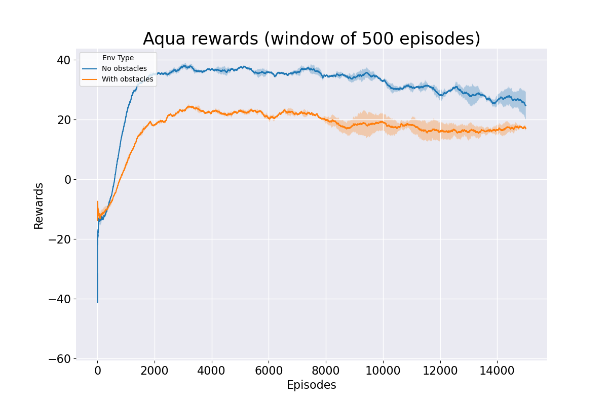
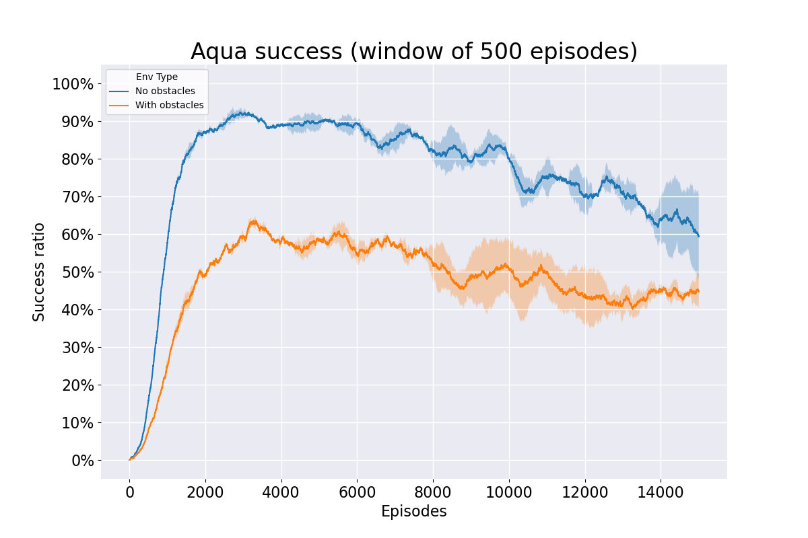

# AquaGym environment

The goal of this AI project is to build a gym environment that simulates the motion of a water drone with differential drive moving in a cluttered environment
and subject to a superimposed non-deterministic water flow. The idea is that a DQN policy can learn its way to reach the goal state providing thrust to the
motors at each step. On top of that, the water flow changes the drone's trajectory and so a correction is needed in order to avoid the collisions. Two types of
environment are offered, differing in the domain of the action space (either continuous or discrete).

### Design choices

- the world dimensions are `100x100`, so the position is in `[0,100] x [0,100]`;
- the angle in `[-pi,+pi]`, from right (`-pi`) to left (`+pi`), where `0` is the north direction;
- the motors' thrust is in `[0.2,0.5]`;
- for the continuous action space case any combination in `[0.2,0.5] x [0.2,0.5]` is allowed;
- for the discrete action space case we provide 3 actions, with indexes from 0 to 2, `[rotate left, rotate right, full throttle]`, which are mapped onto the
  thrusts `(0.2, 0.5)`, `(0.5, 0.2)` and `(0.5, 0.5)`;
- the wave speed is in `[-0.05,+0.05]` with a variance of `0.001`;
- obstacles are rectangles or circles and can be customized in position and size;
- for the reward function we choose:
    - `+10` when the goal is reached;
    - `-10` when hitting either an obstacle or the border;
    - `(prev_dist_from_goal - dist_from_goal) * 0.7` for each non-ending move; both collisions and reaching the goal are ending events;

### DQN implementation

We also provide a Deep-Q-Network implementation to obtain the policy, edit file `dqn_train_policy.py` in order to train the network and `dqn_train_plotter.py`
to see the overall rewards/success during the process. After the training, use `test_dqn.py` to see the resulting policy (we also provide files
`test_optimal.py` and `test_random.py` for comparison) and `dqn_test_plotter.py` to see the overall success rate and reward distribution. A quasi-intuitive plot
of the q-value in the various states is available with `dqn_qvalue_plotter.py`.

With the provided setup, we can obtain results similar to those shown in the plots below.

